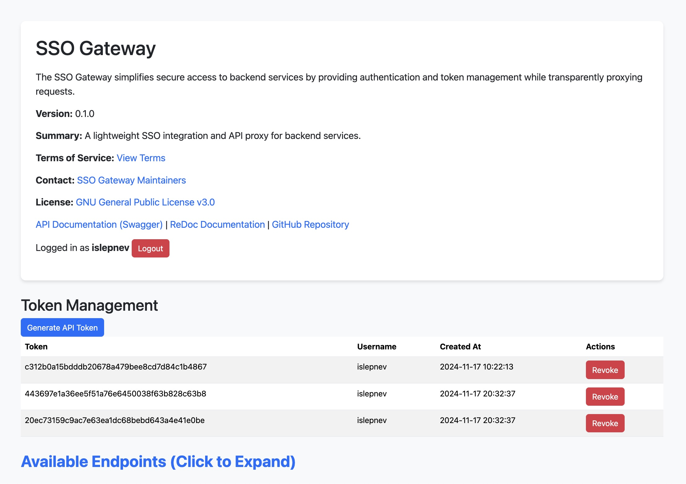

# SSO Gateway

The **SSO Gateway** simplifies secure access to backend services by providing authentication and token management while transparently proxying requests. It supports token-based access to APIs, integrates with Keycloak as an external Identity Provider (IdP), and is designed for use in both standalone and reverse-proxied environments.

---

## Features

- **Token-Based Authentication**: Issue and manage tokens for API access.
- **OIDC Integration**: Supports OpenID Connect (OIDC) for authentication via Keycloak.
- **Dynamic Routing**: Proxy API requests to backend services with dynamic user authentication.
- **Modular Deployment**: Easily deployable via Docker in demonstration or production setups.

---

## Quick Start

To test the SSO Gateway with a demonstration deployment, refer to the [Docker Development Environment for SSO Gateway](docker/README.md). The environment includes:
1. **SSO Gateway**: Authentication and API proxy.
2. **Dummy API**: A simple backend API secured by the SSO Gateway.
3. **Apache Reverse Proxy**: To simulate a typical reverse-proxy setup.
4. **External Keycloak IdP**: Configure your Keycloak instance with the SSO Gateway as a client.

---

## Endpoints

### **Home Page**
- **URL:** `/gateway`
- **Description:** Displays application metadata and token management options for authenticated users.
- **Example:**
  ```bash
  curl http://localhost:8000/gateway
  ```

---

### **API Access**
- **URL:** `/gateway/api/data`
- **Description:** Secures backend API requests with token-based authentication.
- **Example:**
  ```bash
  curl -H "Authorization: Bearer <your-token>" http://localhost:8000/gateway/api/data
  ```

Replace `<your-token>` with a valid API token obtained from the token management section.

---

## Token Management

Tokens allow secure access to backend APIs. Users must authenticate via the SSO Gateway to manage tokens.

- **Create Token**: Navigate to the token management section on the home page and generate a new token.
- **Revoke Token**: Remove access by revoking an existing token.
- **Browse Tokens**: View active tokens, their associated users, and creation timestamps.

---

## Documentation

- **Developer Documentation:** [docs/README.md](docs/README.md)
- **Docker Development Setup:** [Docker Development Environment for SSO Gateway](docker/README.md)

---

## License

This project is licensed under the [GNU General Public License v3.0](https://www.gnu.org/licenses/gpl-3.0.html).

---

## Home Page Preview

Below is a preview of the SSO Gateway home page:


